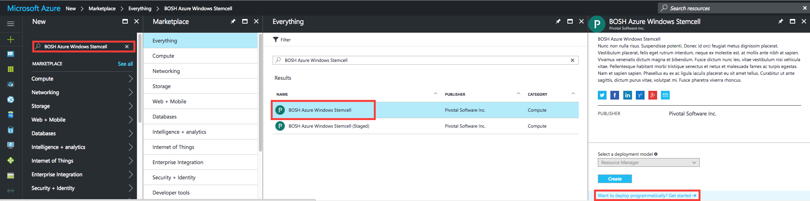

# Using the Azure Light Stemcell

In order to use the Azure light stemcell programmatically, you must accept the license agreement through the Azure marketplace:

1. Navigate to https://portal.azure.com and sign in
1. Click `New`
1. Search for `BOSH Azure Windows Stemcell`
1. Click on `BOSH Azure Windows Stemcell` (not `BOSH Azure Windows Stemcell (Staged)`)
1. Click `Want to deploy programmatically? Get started ➔`
1. Click `Enable` for each subscription that you would like to use the stemcell in
1. Click `Save`

